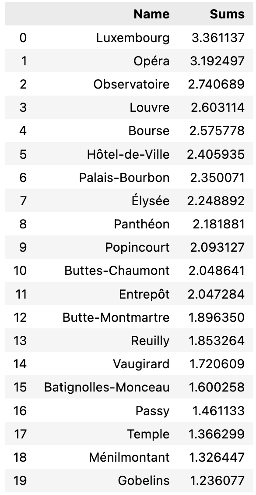

# Project-III | Rocket Studios headquarters' location 📍

Rocket Studios is a company that operates in the videogames sector. It was established in 2021 in Barcelona, since the city is considered one of the most important hubs in tech. 

Until now, Rocket Studios have not had physical offices nor headquarters; all employees worked remotely. However, the company is growing fast and the CEO would like to enhance corporate culture and face-to-face activity among the firm.

With this objective, the CEO asked the Analytics team what district should the company settle its headquarters. Beforehand, the HR team conducted some research among company peers to know which are the needs and demands of the employees regarding the new location.

The summary would be the following:

- The location should be close to other firms belonging to the design sector.

- There must be close startups that have raised at least 1M in funding rounds.

- There must be elementary schools nearby.

- Account managers need to travel a lot.

- Executives like Starbucks A LOT.

- Maintenance guy would like have a close basketball court.

- The office dog—"Dobby" needs a hairdresser every month.

- The CEO loves vegan restaurants.

Having said that, let's get to know the new district location of Rocket Studios!🚀

---
## Table of contents

### MongoDB queries

- Companies that do design
- Successful tech startups
- City choice

### Distance and density criteria

*Distance*
- Airports
- Dog hairdresser
- Basketball court

*Density*
- Starbucks
- Elementary schools
- Vegan restaurants

### Ponderation scheme and results
--- 

## Mongo DB queries and suitable cities

The first objective of the project was to query the companies collection from Mongo DB to check the global distribution of firms that fulfilled the first two requirements: being surrounded by successful tech startups as well as companies with activity in the design sector.

After applying the query, the resulting map had the following shape:

It can be observed that Europe has most of the occurrences, especially in the UK and France.

More on this point, not all companies in the collection included the coordinates of their offices. However, the distribution does not change much. This would be the cities with a higher number of offices according to the query.

For this set of reasons, the best location for our headquarters is going to be Paris.

---

## Distance and density criteria

Moving into the next requirements, we have divided them into distance and density. The reason for that is the necessity of a single establishment or location, or the need of change.

For instance, the CEO might be willing to experience different vegan restaurants. It would be too repetitive to always go to the same establishment. In this case, we will give a ponderation to each Paris district according to the density of vegan restaurants. For density, we took into account districts' area, obtained through scraping. We divided the count of instances per district over its area in squared kilometers.

On the other hand, a single airport is enough for the executives to travel. For example, Paris-Orly or Paris-CDG. In this case, the ponderation will be accounted in terms of distance, having more points those districts that are closer, and viceversa.

To get this information, we used foursquare API, from where we have obtained location data of the establishments or locations of interests. Below, there is an example of some of the data queried for vegan restaurants.

Note that queries were limited to 50 instances. The results would have been much more representative if we could have queried all results in a given radius covering the whole city.

To complete the first example, below we have the distribution plot in Paris' map.

---

## Ponderation scheme

Concerning the district choice, we have developed a ponderation scheme that transform density or distance queries into a weighted result. To achieve that, we have used sklearn library and have normalized each result range to a 0-1 scale. The results between maximum and minimum were transformed proportionally within the scale.

In the table below, we see the result of this ponderation for each variable.

The districts that had a 1 in a given variable had the best score (e.g. the highest density or lowest distance), and viceversa. Those with a value between 0 and 1 had a score between the lowest and the higher, and normalized score acts accordingly.

## Distance variables' results

### Airports

### Dog hairdresser

### Basketball court

## Density variables' results

### Starbucks

### Elementary schools

### Vegan restaurants

# All variables distribution

In the map above, we have the final distribution taking all variables of interest into account. The trend that can be observed in each single variable plot gets consolidated in these results. Centric arrondissements have a higher density of services and establishments and they perform better overall.

Luxembourg takes a clear lead and will become the location for Rocket Studios headquarters!

